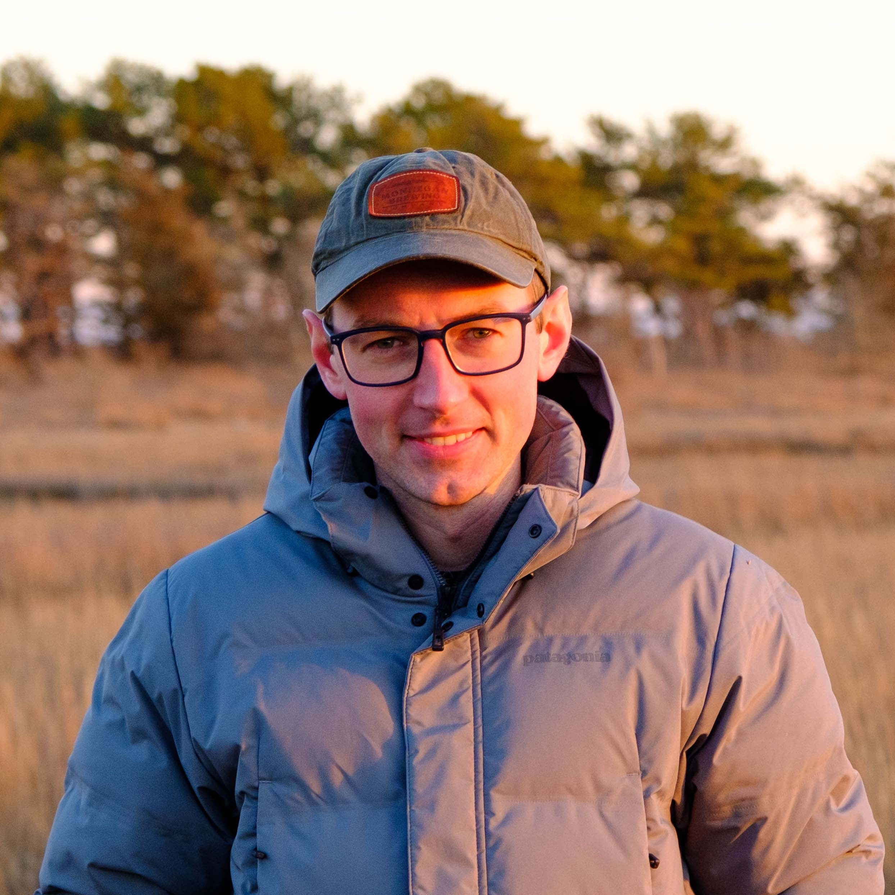

::: {.hero .column-screen}
::: {.hero-inner}

Sawyer Balint

Ph.D. Candidate · NSF GRFP Fellow · <strong>Earth &amp; Environment, Boston University</strong>

I study how human activity has changed estuarine biogeochemistry, past and present, and build analytical tools that make estuarine research more accessible.

<a class="primary" href="publications.qmd"><i class="bi bi-journal-text"></i> Publications</a>
<a href="cv.qmd"><i class="bi bi-file-earmark-person"></i> CV</a>
<a href="https://github.com/sawyerbalint"><i class="bi bi-github"></i> GitHub</a>
<a href="https://www.linkedin.com/in/sawyerbalint"><i class="bi bi-linkedin"></i> LinkedIn</a>
<a href="mailto:sjbalint@bu.edu"><i class="bi bi-envelope"></i> Email</a>
<a href="https://scholar.google.com/citations?user=owN-lBcAAAAJ"><i class="bi bi-mortarboard"></i> Scholar</a>
<a href="https://orcid.org/0000-0003-1088-0358"><i class="bi bi-person-badge"></i> ORCID</a>

:::

Background: <em>Bird's eye view of Narragansett Bay</em>, Walker Lith. &amp; Pub. Co., 1907 · image via <a href="https://bostonraremaps.com/inventory/birds-eye-view-of-narragansett-bay/">Boston Rare Maps</a>

:::

::: {.home-body .column-screen}

About

## Coastal systems under change

I am a Ph.D. Candidate in the [Fulweiler Lab](https://www.fulweilerlab.com) at Boston University, advised by Robinson W. Fulweiler, and an [NSF Graduate Research Fellow](https://www.nsfgrfp.org). I study past, present, and future changes in estuarine biogeochemistry caused by human activity. My current work uses regional and global modeling and mass spectrometry to reconstruct historical nutrient loading in urbanized estuaries and to project how nutrient cycling in these systems will respond to management and climate change.

Much of my work focuses on how we collect, interpret, and share the measurements themselves: how isotope data is normalized on mass spectrometers, how new in-situ instrumentation can expand the spatiotemporal resolution of benthic gas fluxes, and how to make data more accessible and reproducible. Code and data for my papers are openly available.

Before BU, I was an ORISE Fellow at the U.S. EPA Atlantic Coastal Environmental Sciences Division in Narragansett, RI, where I used stable isotopes and sediment cores to study estuarine nitrogen cycling. I earned my bachelor's from Brown University, where my thesis quantified atmospheric nitrogen deposition to Narragansett Bay.

Selected publications



[All publications →](publications.qmd)

:::
