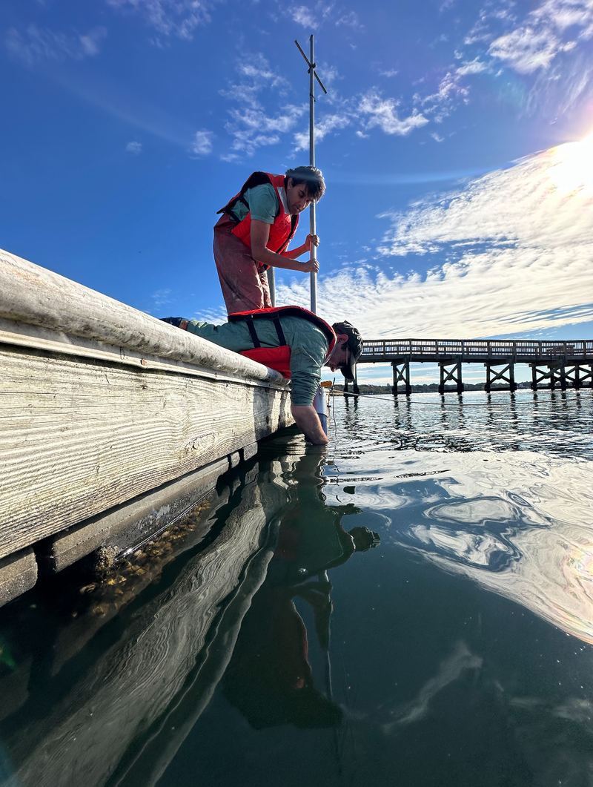
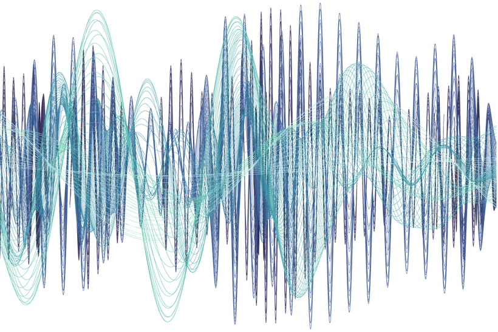
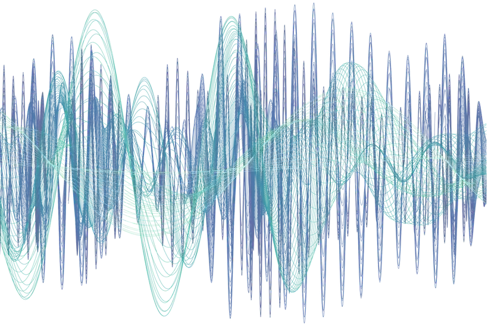
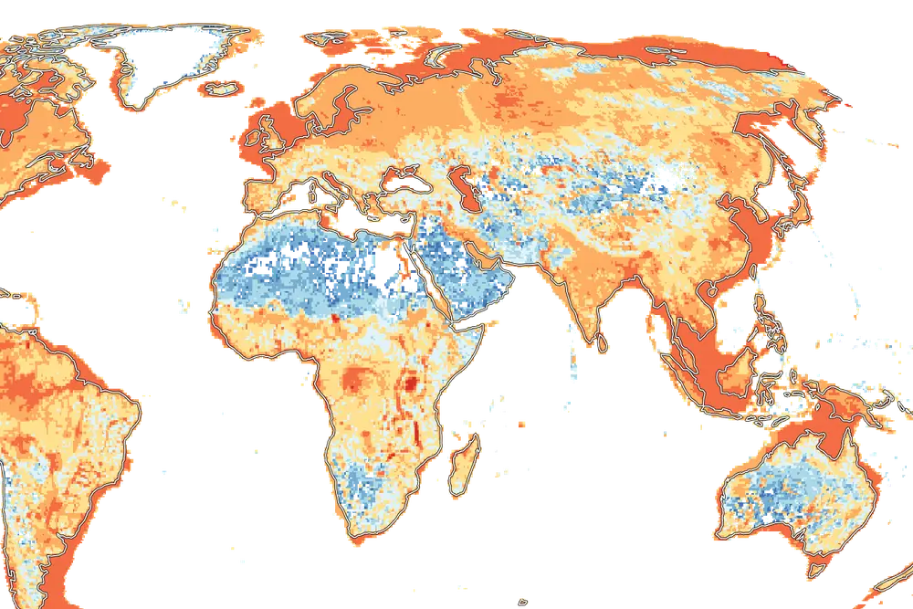
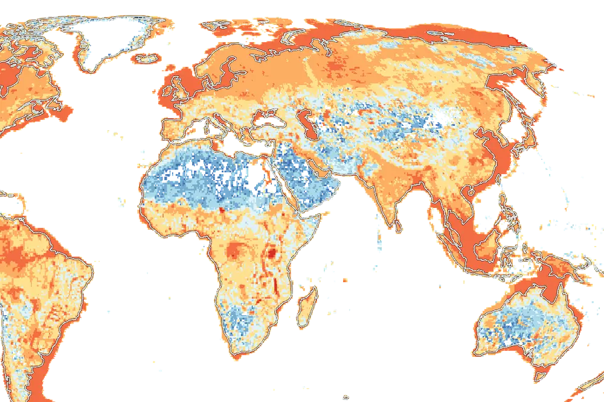
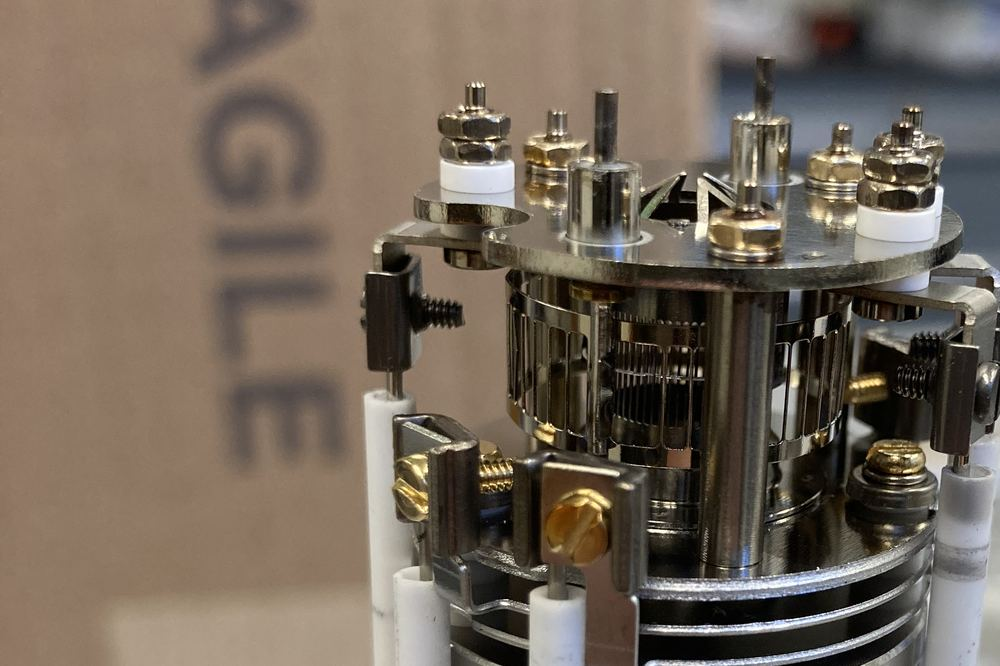

I study past and present changes in estuarine biogeochemistry caused by human activity, and I develop analytical techniques that make estuarine research more accessible. My work spans temporal and spatial scales, from high-resolution sensors to sediment cores spanning centuries, and from regional analyses of Narragansett Bay to global syntheses of inland and coastal waters.

::: {.themes}

::: {.theme .has-photo}

01

### Historical nutrient reconstruction

By combining stable isotopes, radiometric dating, and historical ecology, I use sediment cores to reconstruct how nutrient loading and ecosystem function in urbanized estuaries have changed since before industrialization.

sediment coresδ¹⁵N / δ¹³Chistorical ecology

<figure class="theme-photo" style="--shift: 14%"></figure>
:::

::: {.theme .has-photo}

02

### Ecosystem management

I pair precipitation-explicit nitrogen loading budgets with global climate models to assess how precipitation variability may impact ecosystem management, and use spectral and wavelet analysis of multi-decade monitoring data to interrogate the ecological impacts of management and climate change

net ecosystem metabolismwavelet decompositionnutrient reductionsclimate change

<figure class="theme-photo"></figure>
:::

::: {.theme .has-photo}

03

### Nitrogen fixation and biogenic gases

In collaboration with the [Aquatic Nitrogen Fixation Research Coordination Network](https://www.aquaticnfixation.com), I help synthesize nitrogen fixation rates across inland and coastal waters and estimate their temporal and spatial distribution. I also measure biogenic gas fluxes across the sediment-water interface and have collaborated with greenhouse gas measurements in salt marshes.

N₂ fixationmethaneglobal synthesis

<figure class="theme-photo" style="--shift: 14%"></figure>
:::

::: {.theme .has-photo}

04

### Novel instrumentation

I develop best-practices for elemental analyzer isotope ratio mass spectrometry (EA-IRMS) and am constructing new tools for environmental monitoring, including in-situ underwater quadropole mass spectrometers.

EA-IRMSbenthic flux chambersinstrumentation

<figure class="theme-photo" style="--shift: 14%"></figure>
:::

:::

## Funding


